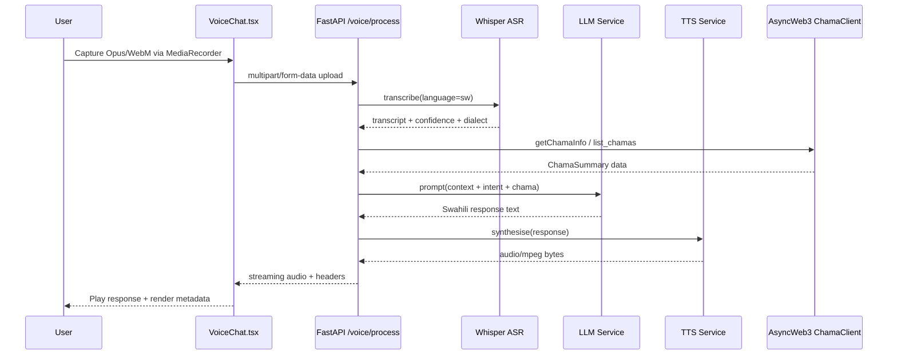
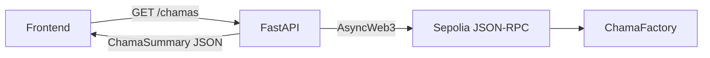

# Chamas - Community Savings Powered by Ethereum

## 🌍 Overview

**Chamas** is an Ethereum-powered community savings platform designed for West Africa, featuring a Swahili AI assistant for financial inclusion. Built for the **ETH Safari Hackathon 2025** - AI & Swahili LLM Challenge ($10,000 track).

### What is a Chama?

A **chama** (Swahili for "group") is a traditional community-based savings and investment group popular in Kenya and East Africa. Members pool their resources together, contribute regularly, and receive payouts in rotation. Chamas brings this time-tested model to the blockchain for transparency, security, and global accessibility.

## ✨ Features

### 🔗 Ethereum Blockchain Integration
- **MetaMask / RainbowKit** – Wallet onboarding and multi-connector support
- **Verified Smart Contracts** – `ChamaFactory`, `Chama` clone implementation, `ChamaToken`
- **Sepolia Testnet** – Live transactions on `chainId 11155111`
- **On-chain Transparency** – Contributions, joins, rotations emitted as indexed events
- **Deployment Scripts** – Deploy, interact, and seed demo data via Hardhat scripts

### 🤖 Swahili AI Assistant
- **Bilingual Support** - Swahili (Kiswahili) and English
- **Voice Input** - Speak in Swahili using Web Speech API
- **Text-to-Speech** - Hear responses in Swahili
- **Financial Guidance** - AI-powered help for chama management
- **Cultural Context** - Understanding of East African financial practices

### 💰 Chama Management
- **Create Savings Groups** - Set contribution amounts and frequency
- **Join Existing Chamas** - Browse and join active groups
- **Automated Contributions** - Smart contract-based payments
- **Transparent Payouts** - Fair rotation system
- **Member Dashboard** - Track your savings and payouts
- **Sepolia Contract Reader** - FastAPI fetches live data via `AsyncWeb3`

### 📱 Mobile-First Design
- **Responsive UI** - Works on all devices
- **Touch-Friendly** - Optimized for mobile browsers
- **Low-Bandwidth** - Efficient data usage
- **Progressive Web App** - Install on home screen

## 🚀 Getting Started

### Prerequisites

- Node.js 18+
- Python 3.11+
- Docker (optional but recommended for local parity)
- MetaMask browser extension
- Sepolia testnet ETH (get from [Sepolia Faucet](https://sepoliafaucet.com/))

### Installation

```bash
# Frontend (React + Vite)
cd frontend
npm install
npm run dev  # http://localhost:5173

# Backend (FastAPI voice pipeline)
cd ../backend
python -m venv .venv && source .venv/bin/activate
pip install -r requirements.txt
uvicorn main:app --reload --host 0.0.0.0 --port 8000

# Smart contracts (Hardhat)
cd ../contracts
npm install
npx hardhat compile
npx hardhat test

# Optional: run everything with Docker
cd ..
docker-compose up --build
```

### Environment Variables

Backend (`backend/.env` or exported before running `uvicorn`):

- `REDIS_URL` – optional Redis instance for session memory (`redis://localhost:6379/0`)
- `SEPOLIA_RPC_URL` – Infura/Alchemy endpoint for Sepolia
- `CHAMA_FACTORY_ADDRESS` – deployed ChamaFactory contract
- `ENCRYPTION_KEY` – 32-byte base64 Fernet key for session tokens
- `OPENAI_API_KEY` / `OPENAI_BASE_URL` – optional OpenAI-compatible LLM endpoint
- `GOOGLE_APPLICATION_CREDENTIALS` – path to Google Cloud TTS service account

Frontend (`frontend/.env.local`):

- `VITE_APP_NAME` – display name (defaults to Chamas)
- `VITE_API_URL` – base URL for the FastAPI backend (e.g. `http://localhost:8000`)
- `VITE_CHAMA_FACTORY_ADDRESS` – deployed factory on Sepolia
- `VITE_USDC_ADDRESS` – ERC20 used for contributions (default Sepolia USDC faucet token)
- `VITE_SEPOLIA_CHAIN_ID` – defaults to `11155111`
- `VITE_SEPOLIA_RPC_URL` – RPC for wagmi public client
- `VITE_WALLETCONNECT_PROJECT_ID` – WalletConnect app id

Copy `frontend/env.local.sample` to `.env.local` to get started.

Contracts (`contracts/.env.local` or exported before running scripts):

- `SEPOLIA_RPC_URL`
- `PRIVATE_KEY`
- `ETHERSCAN_API_KEY` (optional)

## 🎯 How to Use

### 1. Connect Your Wallet
- Click "Connect Wallet" button
- Approve MetaMask connection
- Switch to Sepolia testnet if needed

### 2. Explore Chamas
- Browse available savings groups
- Filter by frequency (weekly/monthly)
- View details: members, contributions, payouts

### 3. Join a Chama
- Select a chama with available slots
- Click "Join" button
- Confirm transaction in MetaMask
- Start contributing!

### 4. Use AI Assistant
- Click the chat bubble in bottom-right
- Ask questions in Swahili or English
- Use voice input (click microphone icon)
- Get help with chama creation, contributions, etc.

### Example Swahili Commands

```
"Habari!" - Greet the assistant
"Unda chama" - Create a new chama
"Jiunge na chama" - Join a chama
"Chama ni nini?" - Learn about chamas
"Msaada" - Get help
```

## 🏗️ Architecture

### Tech Stack

- **Frontend**: React 19 + TypeScript + Vite
- **Styling**: Tailwind CSS 4 + shadcn/ui
- **Blockchain**: Hardhat + Solidity 0.8.20 + ethers.js + wagmi + viem
- **AI**: FastAPI (Whisper ASR + LLaMA 3.1/Gemini + Google/Coqui TTS)
- **Routing**: wouter (lightweight React router)
- **State**: React Query

### Project Structure

```
chamas/
├── backend/                     # FastAPI voice pipeline + Swahili AI services
│   ├── main.py                  # /voice/process + /chamas endpoints
│   ├── services/                # ASR, LLM, TTS, Redis memory, security
│   ├── blockchain/              # AsyncWeb3 Sepolia client helpers
│   ├── requirements.txt
│   └── Dockerfile
├── frontend/                    # React + Vite Lovable client
│   ├── src/                     # Components, pages, lib utilities
│   ├── public/
│   └── Dockerfile
├── contracts/                   # Hardhat configuration, Solidity, deployment scripts
├── docs/                        # Architecture & playbooks
├── docker-compose.yml           # Local dev topology
└── package.json                 # Root scripts (optional)
```

For design details see `docs/chamas-smart-contracts.md`. Deployment playbook lives in `docs/chamas-deployment-quickstart.md`.                                  

### Deployed Contracts (Sepolia)

Addresses are generated via `contracts/scripts/deploy.js` and saved in `contracts/deployment.json`. Update this section after each deployment.

| Contract | Address | Notes |
| --- | --- | --- |
| ChamaFactory | _TBD_ | Primary registry |
| Chama Implementation | _TBD_ | Clone target |
| ChamaToken | _TBD_ | Governance token |
| USDC (Test Asset) | `0x6f14c9687ccf0532413d582b8f6320802f89f90a` | Faucet mintable |

### System Architecture (High-Level)

```mermaid
graph TD
    A[Voice/Web User] -->|Audio/Text| B[Frontend (React/Vite)]
    B -->|REST: POST /voice/process| C[FastAPI Backend]
    B -->|REST: GET /chamas| C
    C -->|ASR| D[Whisper Base<br/>CUDA/CPU inference]
    C -->|LLM| E[LLaMA 3.1 8B<br/>or OpenAI-compatible endpoint]
    C -->|TTS| F[Google Cloud TTS<br/>or Coqui]
    C -->|AsyncWeb3| G[Sepolia RPC Provider]
    G --> H[ChamaFactory Contract]
    C -->|Redis Sessions| I[Redis Memory Store]
    C -->|Prometheus| J[Metrics Collector]
```

### Voice Processing Sequence



## 🌐 Swahili Language Support

### Key Terms

| English | Swahili | Usage |
|---------|---------|-------|
| Chama | Chama | Savings group |
| Contribution | Mchango | Regular payment |
| Payout | Malipo | Distribution |
| Members | Wanachama | Group participants |
| Savings | Akiba | Accumulated funds |
| Join | Jiunge | Become a member |
| Create | Unda | Start new chama |
| Weekly | Kila Wiki | Frequency |
| Monthly | Kila Mwezi | Frequency |

### AI Capabilities

- **Dialect Support**: Kenyan Swahili (sw-KE)
- **Code-Switching**: Mixed Swahili-English
- **Financial Vocabulary**: Chama-specific terms
- **Voice Recognition**: Whisper ASR backend with browser fallback
- **Text-to-Speech**: Google Cloud / Coqui Swahili voices
- **Latency Targets**: ASR ≤ 0.5s, LLM ≤ 1.0s, TTS ≤ 1.5s (95th percentile)

## ⛓️ Smart Contract Deep Dive

### Contract Interface

```solidity
contract ChamaFactory {
    function createChama(string memory name, uint256 contributionAmount, uint256 contributionFrequency) external returns (uint256);
    function joinChama(uint256 chamaId) external;
    function contribute(uint256 chamaId) external payable;
    function getChamaInfo(uint256 chamaId) external view returns (Chama memory);
}
```

| Function | Description | Emits | Notes |
|----------|-------------|-------|-------|
| `createChama` | Deploys a new chama with caller as owner | `ChamaCreated` | Owner auto-enrolled, frequency persisted as seconds |
| `joinChama` | Adds sender as member if active | `ChamaJoined` | Prevents duplicates via `members` mapping |
| `contribute` | Accepts ETH contribution | `ContributionReceived` | Requires membership and `msg.value >= contributionAmount` |
| `getChamaInfo` | Returns struct snapshot | - | Queried by backend `/chamas` and `/voice/process` |

### Deployment Workflow

```bash
cd contracts
npx hardhat test
SEPOLIA_RPC_URL=<https://...> PRIVATE_KEY=<0x...>
npx hardhat run scripts/deploy.js --network sepolia
npx hardhat verify --network sepolia <deployed-address>  # optional
```

Set the resulting address in `backend/.env` as `CHAMA_FACTORY_ADDRESS` and restart the FastAPI service.

### On-Chain Data Flow



- `ChamaClient.list_chamas(limit)` queries `chamaCount()` then batches `getChamaInfo(id)` using `asyncio.gather`.
- Responses are normalized into ETH + wei values, stored as `ChamaSummary.to_dict()` and sent to the UI.
- If the RPC call fails, the UI falls back to mock data but flags degraded blockchain connectivity.

### Observability & Safety

- Prometheus gauges: `asr_latency_seconds`, `llm_latency_seconds`, `tts_latency_seconds`, `voice_requests_total`.
- SlowAPI throttles `/voice/process` and `/chamas` at 10 req/min per IP.
- Optional Fernet encryption (`ENCRYPTION_KEY`) obfuscates `session_id` returned to the browser.

## 🔐 Security

- **Non-Custodial**: You control your keys
- **Smart Contracts**: Auditable on-chain logic
- **MetaMask Integration**: Industry-standard wallet
- **Testnet First**: Safe testing environment
- **No Private Keys**: Never stored or transmitted
- **Rate Limiting**: SlowAPI enforces 10 req/min per IP on voice endpoints
- **Session Encryption**: Optional Fernet key encrypts session headers

## 🎨 Design Philosophy

- **Mobile-First**: Optimized for African mobile users
- **Low-Bandwidth**: Efficient for slower connections
- **Culturally Relevant**: Swahili language and chama concepts
- **Accessible**: Voice input for literacy barriers
- **Transparent**: All transactions on blockchain

## 🏆 ETH Safari Hackathon

### AI & Swahili LLM Challenge

This project addresses the $10,000 AI & Swahili LLM Challenge by:

1. **Swahili Language Model**: AI assistant with Swahili understanding
2. **Voice AI**: Speech recognition and text-to-speech in Swahili
3. **Financial Inclusion**: Making Web3 accessible to Swahili speakers
4. **Cultural Context**: Understanding chama traditions
5. **Real-World Impact**: Solving actual savings challenges

### Judging Criteria

- ✅ **Accuracy & Robustness**: Swahili understanding with financial context
- ✅ **Real-Time Responsiveness**: Fast AI responses, voice input
- ✅ **Innovation**: Blockchain + AI for community savings
- ✅ **Ethical Data Handling**: No personal data stored, privacy-first
- ✅ **Practicality & Impact**: Solving real financial inclusion challenges

## 🧪 Testing & Benchmarking

- **Hardhat**: `npx hardhat test` covers deployment, membership, and contribution flows.
- **Voice Pipeline**: `pytest` suite (planned) will mock ASR/LLM/TTS with fixtures; use `/voice/process` curl scripts for latency sampling.
- **WER Tracking**: `backend/scripts/finetune_whisper.py` exposes evaluation hooks; target `<20%` WER on Mozilla Common Voice Swahili subset.
- **Load Tests**: `locustfile.py` (coming soon) will stress `/voice/process` and `/chamas` to validate SlowAPI throttling and Redis TTL behaviour.
- **Metrics**: scrape `/metrics` with Prometheus or run `docker-compose up prometheus grafana` (planned) for dashboarding.

## 🚧 Roadmap

### Phase 1: MVP (Current)
- [x] MetaMask integration
- [x] Swahili AI chatbot
- [x] Voice input/output
- [x] Mock chama data
- [x] Mobile-responsive UI

### Phase 2: Smart Contracts
- [x] Deploy Chama smart contracts (factory + clones + token)
- [x] Real on-chain contributions via ERC20 approval flow
- [x] Automated payout distribution (rotation + SafeERC20 transfers)
- [ ] Multi-signature wallets

### Phase 3: Advanced Features
- [ ] M-Pesa integration
- [ ] Offline mode (PWA)
- [ ] Multi-dialect Swahili support
- [ ] Governance voting
- [ ] Chama analytics

### Phase 4: Scale
- [ ] Mainnet deployment
- [ ] Cross-chain support
- [ ] Mobile native apps
- [ ] Community partnerships

## 🤝 Contributing

Contributions welcome! Please:

1. Fork the repository
2. Create a feature branch
3. Make your changes
4. Submit a pull request

## 📄 License

MIT License - see LICENSE file for details

## 🙏 Acknowledgments

- **ETH Safari Hackathon** - For the opportunity
- **Ethereum Foundation** - For blockchain infrastructure
- **OpenAI** - For LLM capabilities
- **Kenyan Chama Communities** - For inspiration
- **Swahili Language Community** - For cultural guidance

## 📞 Contact

- **Project**: Chamas
- **Hackathon**: ETH Safari 2025
- **Track**: AI & Swahili LLM Challenge ($10k)
- **Built with**: ❤️ for financial inclusion in Africa

---

**Akiba ya Jamii, Mustakabali wa Jamii** 
*Community Savings, Community Future*

🌍 Making Web3 accessible to 200M+ Swahili speakers worldwide

